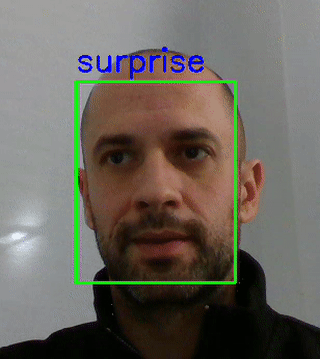

# facial-expression-detector-DNN
The code you will find in this repo represents the results of my personal training and evolution in concepts related with Deep Neural Networks.

The goal was to build a facial expression detector to infere and detect different emotions from human faces as input images.

First, I tried to build a model based on a simple deep neural network. This kind of architectures works fine with low level features images and sizes as the MNIST dataset presents. As the problem becomes harder, like emotions detection from faces, and images become larger, like FER2013 dataset, it is neccesary to use convolutions. 

## Neural net class
First I developed a class which represent a DNN as an instantiated object. You can model the architecture: number of hidden layers and number of neurons in each layer. There exist several methods to make forward and backward prop, apply cost funtion and run gradient descent. I have also coded a method to evaluate de results of the training vs a test set of input samples. 

## MNIST data set
To validate the nerural net class I used the MNIST dataset which you can find in this repo as a .csv files. It contains 60,000 training samples plus 10,000 test samples of manuscript digits (0-9) in 28x28 pixel grayscale image format and a color depth of 8 bits per pixel
It is very gratefull to see it works like a charm :)

  

## FER2013 dataset
To develop the final model based on a CNN architecture I used the FER2013 dataset which you can find in the data_FER2013 folder from this repo. It consists of 48x48 pixel grayscale images of faces. Each face is based on the emotion shown in the facial expression into one of seven categories (0=Angry, 1=Disgust, 2=Fear, 3=Happy, 4=Sad, 5=Surprise, 6=Neutral). The training set consists of 28,709 examples and the public test set consists of 3,589 examples.

I tried several CNN architectures and found VGG19 as the best solution reaching up to 67´8% of accuracy. In the repo you can play training and testing this model and also several ResNet architectures.

  

## Dependencies
Python: 3.10.12\
Numpy: 1.26.1\
MTCNN: 1.0.0\
Pytorch: 2.8.0\
Tensorflow: 2.16.1\
Jetpack: 6.2.1 (running in a Jetson Orin Nano)\
CUDA: 12.6

An Intel RealSense D435 camera was used to test the model

## Author

* **Ruben Sanchez** - [rubinsan](https://github.com/rubinsan)

## License

This project is licensed under the [MIT License](LICENSE).
